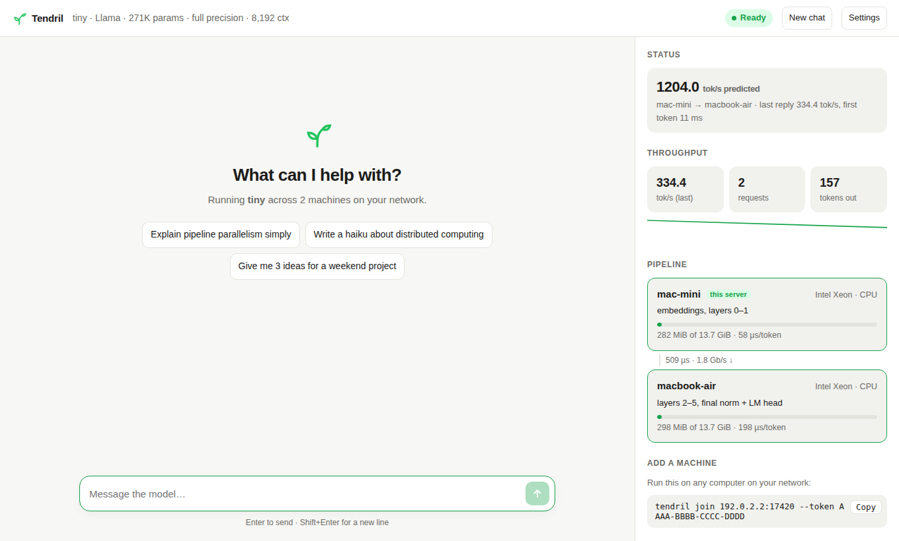

# Tendril

**Plan and run LLMs across the machines you already have.**

Tendril looks at a model and at your computers and decides how to run it: on
one machine, split across several, or not at all. It explains every decision
in plain language and tells you exactly what to change when something doesn't
fit.

```text
$ tendril plan gemma-2-9b --node m4-air=m4:16 --node m5-air=m5:16 --link thunderbolt --quantize q8_0

✓ Runs across 2 machines (m4-air → m5-air)
  ~10.7 tok/s per conversation · first token in ~4.97 s

  STAGE  MACHINE      RUNS                                MEMORY                          DECODE
  1      m4-air (M4)  embeddings, layers 0–11             ███████░░░░░░░░░  4.6/10.7 GiB   29 ms
  2      m5-air (M5)  layers 12–41, final norm + LM head  █████████████░░░  9.0/10.7 GiB   65 ms
         network      7.06 KiB per hop per token + sampled token back                     143 µs

Why this plan
  • m4-air can't hold it alone: needs 12.4 GiB … but m4-air allows 10.7 GiB
  • 27 of 41 cuts fit. The fastest (after layer 7) is 2.0 ms quicker but would fill m5-air
    to 93% of its budget; this plan keeps more headroom. Use --goal latency to take it.
  • Embeddings are tied to the output head, so both ends hold a copy (930 MiB).
```

## Install

```bash
git clone https://github.com/hetsaraiya/Tendril && cd Tendril

# Apple Silicon (Metal GPU):
cargo install --path crates/tendril-cli --features metal
# NVIDIA (CUDA toolkit installed):
cargo install --path crates/tendril-cli --features cuda
# Anything else (fast CPU kernels, AVX2/NEON):
cargo install --path crates/tendril-cli

tendril doctor        # check this machine
```

Requires Rust 1.82+. Models come from HuggingFace (safetensors); gated models such as
Llama and Gemma need `HF_TOKEN`.

## Run a model on one machine

```bash
tendril run qwen2.5-1.5b                     # downloads, loads, opens a chat in your terminal
tendril run Qwen/Qwen2.5-7B-Instruct -q q8_0 # quantize on load to halve memory
tendril run ~/models/my-model -p "Hello!"    # one-shot answer from a local folder
```

## Run a model across machines

On the machine with the model (the **coordinator**):

```text
$ tendril serve Qwen/Qwen2.5-14B-Instruct

Tendril · serving Qwen/Qwen2.5-14B-Instruct
  Web chat   http://192.168.1.20:8080
  API        http://192.168.1.20:8080/v1  (OpenAI-compatible)
  Add more   run this on another machine to add it:
             tendril join 192.168.1.20:7420 --token 7Q2K-9XMP-4HVD-J3FA

17:55:13 ! Qwen2.5-14B doesn't fit on the 1 machine here yet: needs 29.4 GiB, m4-air allows 10.7 GiB …
```

On every other machine, paste the join command:

```text
$ tendril join 192.168.1.20:7420 --token 7Q2K-9XMP-4HVD-J3FA
17:55:20 ✓ joined as m5-air — serving Qwen/Qwen2.5-14B-Instruct
17:55:21 ↓ receiving weights for layers 22–47 + head: 6.1 GiB/13.9 GiB (44%)
17:56:02 ✓ running layers 22–47 + head (13.9 GiB, Metal) — ready in 41.3 s
```



As machines join, Tendril measures each link, re-plans automatically and starts serving
as soon as the model fits. Then:

- open the **web chat** (conversation + live view of the pipeline, memory, links and throughput),
- chat from a terminal with `tendril chat`,
- point any OpenAI client at `http://<coordinator>:8080/v1`,
- watch the cluster with `tendril status`.

What happens under the hood:

- **Only the needed weights move.** Each machine receives exactly the tensors of its
  layers (never the whole checkpoint), streamed from the coordinator and cached on disk,
  so a restart reloads instantly.
- **Only activations cross the network.** Each token sends one hidden-state vector per
  machine boundary and a single token id back — a few KB, not the model.
- **Every link is authenticated and encrypted** (Noise protocol, pre-shared cluster
  token). A machine without the token can't join, read activations or inject work.
- **Failures are explicit.** If a machine leaves, in-flight requests end with a clear
  error, the cluster re-plans with who's left, and resumes when it fits again.
- **Splitting is exact.** Pipeline execution is bit-identical to running the model on one
  machine (`tendril verify <model>` checks this for any model).

Useful flags: `--context 32k`, `--concurrency 8`, `--quantize q8_0|q4_k`,
`--goal latency|throughput|memory`, `--max-memory 8gb` (cap what Tendril may use on a
machine, on `serve` or `join`), `--min-machines 2` (force a split, e.g. to measure its
cost), `--no-local` (coordinate only).

### Measure it

```bash
tendril bench                       # against a running `tendril serve`
tendril bench qwen2.5-1.5b          # or load a model in-process and measure it
tendril bench --concurrency 1,2,4,8 --prompt-tokens 128,2048 --output-tokens 256 --runs 5
```

`tendril bench` runs a fixed protocol — warm-up, prompt-length × concurrency sweep,
repeated runs, end-of-sequence ignored so every request generates the same length — and
reports time-to-first-token and inter-token latency percentiles, per-request and total
throughput, the planner's prediction next to the measurement, and **where each token's
time goes** (per-stage compute, queueing, network), from timings every stage stamps onto
the tokens it produces. It writes a self-contained HTML report with charts.

**The planner learns.** While serving, the coordinator compares each machine's measured
compute time with the plan's prediction and stores the ratio
(`~/.config/tendril/calibration.json`); the next plan uses how fast machines really are.
`tendril node --probe` measures memory bandwidth and is reused for two weeks — by `plan`,
`serve`, and by machines when they `join`.

### OpenAI-compatible API

```bash
curl http://localhost:8080/v1/chat/completions -H 'Content-Type: application/json' -d '{
  "messages": [{"role": "user", "content": "Write a haiku about tendrils"}],
  "stream": true
}'
```

`/v1/chat/completions` and `/v1/completions` support streaming, `temperature`, `top_p`,
`top_k`, `min_p`, `seed`, `stop`, `max_tokens`, presence/frequency/repetition penalties
and `stream_options.include_usage` (plus `ignore_eos` for benchmarking); `POST /tokenize`
counts tokens. Responses include a `tendril` object with
time-to-first-token and decode speed. `/api/status` exposes the cluster as JSON.

### Supported models

Architectures: **Llama** (1–3.3, incl. Llama 3 RoPE scaling), **Mistral**, **Qwen 2 / 2.5**,
**Qwen 3**, **Gemma 1 / 2 / 3** (sliding-window attention, soft-capping), **Phi-3**.
Every architecture is verified against HuggingFace `transformers` (max relative logit
error ~1e-6 in f32; see `tools/make_test_models.py`). Weights: bf16/f16/f32 safetensors,
optionally quantized on load to q8_0, q6_k or q4_k.

## Planning without running

## How the planner works

1. **Inspect** the model: layer count, attention layout (including sliding-window layers
   that cap KV growth), tied embeddings, and — when tensor headers are available — the
   exact bytes of every component.
2. **Budget** each machine honestly. On Apple Silicon the GPU may only wire about ⅔ of RAM
   by default (Tendril tells you how to raise it). A plan fits only when
   `weights + KV cache + activation scratch + transport buffers + runtime + safety margin`
   fits every machine, including load-time peaks. Two 16 GB Macs are not a 32 GB GPU.
3. **Search** every ordered subset of machines and, for each, solve an exact dynamic
   program over all contiguous layer cuts (millions of cuts in milliseconds). A machine
   is left out when including it would slow things down — and Tendril says so.
4. **Predict** decode speed (memory-bandwidth bound: each token streams the stage's
   weights), chunked, pipelined prefill, and the per-token network hop plus the sampled
   token's trip back.
5. **Rank** by goal and **advise**: shortest context that fits, quantizations that fit
   (with quality notes), macOS GPU limits, network upgrades, how much memory to add.

Predictions come from hardware specs; they are estimates, clearly labelled as such.

## Project docs

- [What Tendril is and its main challenges](docs/project-and-challenges.md)
- [Approaches and experiments to try first](docs/approaches-and-experiments.md)
- [Original imported project context](docs/project-context.md)
- [Full readable source conversation](docs/source-conversation.md)
